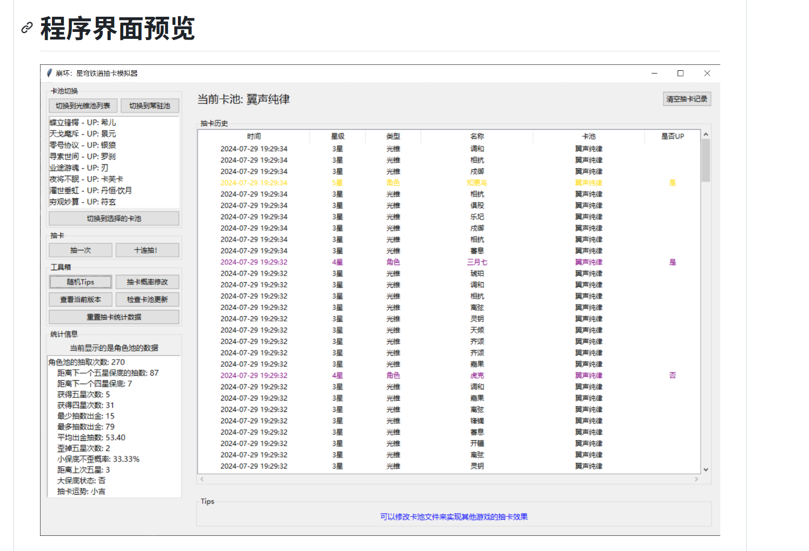

# 抽卡模拟器 (Gacha Simulator)

一个用 Python 编写的抽卡模拟器，包含命令行版和桌面 GUI 版。

## 功能特性

- 基础概率：六星 2%、五星 8%、四星 50%、三星 40%
- 六星保底：超过 50 抽未出六星后，每抽六星概率 +2%（其余星级按权重缩减）
- UP 机制：六星中 50% 为 UP；若连续 2 次六星非 UP，则下一次六星必为 UP
- 抽卡模式：单抽、十连
- 状态持久化：保留保底进度与 UP 连歪进度
- 记录查看与清空：支持历史记录查看、清空记录和状态
- GUI 批次分隔：每次单抽/十连会自动生成“批次分隔行”和“批次编号”，便于区分每一轮结果

## 环境要求

- Python 3.8+
- GUI 版使用标准库 `tkinter`（Windows 自带 Python 通常已包含）

## 快速开始

在项目目录下运行：

### 1) 命令行版

```bash
python gacha_simulator.py
```

### 2) GUI 版

```bash
python gacha_gui.py
```

## 使用说明

### 命令行版菜单

- `1`：单抽模式（输入抽卡次数）
- `2`：十连抽模式（固定 10 抽）
- `3`：查看抽卡记录
- `4`：清空历史记录与状态
- `q`：退出

### GUI 版操作

- `抽一次`：执行 1 抽
- `十连抽`：执行 10 抽
- `清空记录与状态`：清空记录文件和保底状态
- `导出当前记录`：导出当前界面表格为 `gacha_ui_export.csv`

GUI 记录区说明：

- 每次抽卡开始前会插入分隔行（如 `========== 第3次十连（共10抽） ==========`）
- 同一轮抽卡的每条记录都会显示相同的“批次”编号（如 `第3次`）

## 保底规则细节

- 六星基础概率为 2%
- 当“连续未出六星次数”大于 50 时：
  - 六星概率 = `2% + (当前未出次数 - 50) * 2%`
  - 六星概率上限为 100%
- 非六星概率按五星/四星/三星原始权重（8:50:40）缩放

## 数据文件说明

- `gacha_simulator.py`：命令行主程序与核心抽卡逻辑
- `gacha_gui.py`：桌面 GUI 程序（复用核心抽卡逻辑）
- `gacha_state.json`：保底与 UP 状态（自动生成）
- `gacha_history.txt`：命令行抽卡历史（自动生成）
- `gacha_ui_history.json`：GUI 抽卡历史与统计（自动生成）
- `gacha_ui_export.csv`：GUI 导出文件（手动导出后生成）

## ????



## License

MIT License
